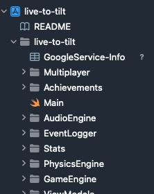
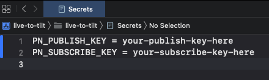
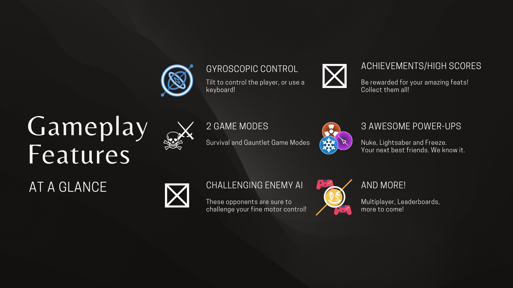
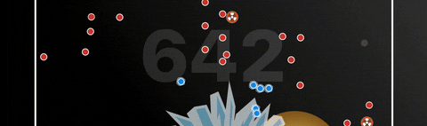
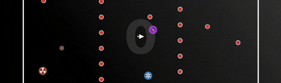
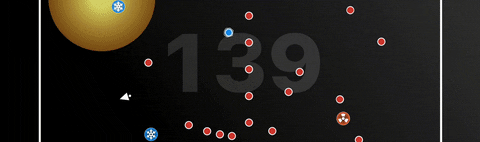

<!-- markdownlint-disable MD033 MD041 -->

# Live to Tilt

No buttons or joysticks, just tilt. Tilt to avoid enemies and activate powerups. Tilt for your life.

---

## Overview

Live to Tilt is a re-creation of the popular iOS game Tilt to Live, a childhood favourite of ours! Just like in the original game, there are no buttons or joysticks. You tilt your device to control your character. Avoid the red dots that appear on the screen while collecting power-ups to obliterate them! Chain your kills to build up your combo and rake in the points!

## Team Members

This iPadOS app is a final project of CS3217, Software Engineering on Modern Application Platforms. Made with ❤️ by:

- [Goh Wen Hao](https://github.com/wenhaogoh)
- [Chester How](https://github.com/chesterhow)
- [Lui Kai Siang](https://github.com/kslui99)
- [Maxx Chan](https://github.com/maxxyh)

## Getting Started

Live to Tilt is written in Swift and developed in Xcode Version 13.2. Simply clone the repository to get started!

### Installing Xcode

1. Get Xcode from the [App Store](https://apps.apple.com/us/app/xcode/id497799835) or https://developer.apple.com/downloads.

2. Install the Xcode Command Line Tools
   In Terminal, run the command: `xcode-select --install`

### Setting up Firebase

3. Follow the instructions [here](https://firebase.google.com/docs/ios/setup) to create a Firestore Database on Firebase.

4. Download the Firebase configuration file and add it to the source directory. It should look something like this:

   

### Setting up PubNub

5. Create a free PubNub account [here](https://www.pubnub.com/) to obtain a demo keyset.

6. Copy the keyset into the `Secrets.xcconfig` file. It should look something like this:

   

### You are done!

7. Build and run the code with Xcode to play Live to Tilt now!

## Documentation

For more details on our technical design, please refer [here](https://docs.google.com/document/d/1IRGTh3BoQcHm0VggbzeEvdI_CIv9YHHpy2I9CQEtg08/edit?usp=sharing).

## Features

### 3 Awesome Powerups

   
   <h3>NUKE</h3>
   
Kaboom! Obliterates all enemies within the vicinity.

   

   
   <h3>LIGHTSABER</h3>
   
Wield 2 deadly lightsabers and blitz those dots to oblivion!

   

   
   <h3>FREEZE</h3>
   
Freeze your enemies and shatter them while they're frozen!

   

## User Guide

Please refer to the User Manual section in our [documentation](https://docs.google.com/document/d/1IRGTh3BoQcHm0VggbzeEvdI_CIv9YHHpy2I9CQEtg08/edit?usp=sharing).
